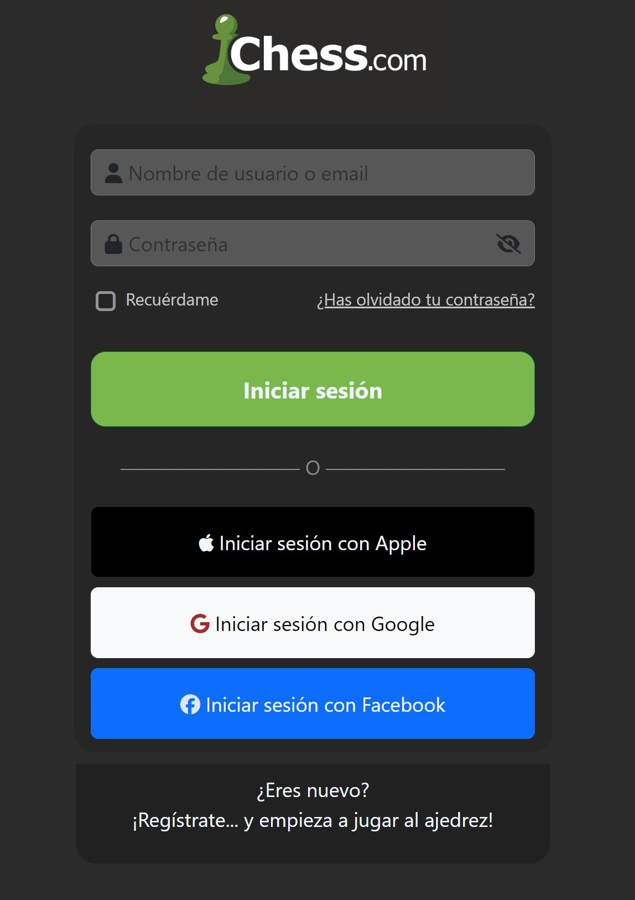

# Unidad 4
Estoy entusiasmada de aprender lenguajes de programación, espero terminar este curso satisfactoriamente.
## Temas aprendidos:
  - Responsive.
  - Bootstraps; forms, medidas, estilos de textos, contenedores.
### Sesion 60.- Login con Bootstraps
